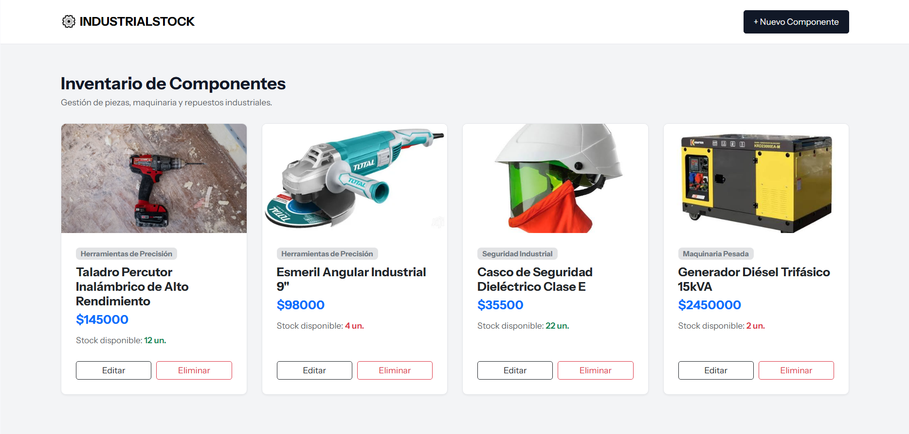

# ⚙️ IndustrialStock - Sistema de Inventario Industrial

Sistema web minimalista y moderno desarrollado en **Django** y estilizado con **Bootstrap 5**, enfocado en la gestión ágil de componentes y repuestos industriales sin requerir inicio de sesión.

## ✨ Características
- **Catálogo Visual:** Visualización de productos en formato de tarjetas con indicadores de stock en tiempo real (alerta de stock crítico).
- **Gestión de Imágenes:** Soporte completo para carga y visualización de fotografías de componentes (`ImageField` / Pillow).
- **CRUD Completo:** Registro, edición, visualización y eliminación de componentes industriales categorizados.

---

## 📸 Vista Previa

---

## 🚀 Tecnologías Utilizadas
- **Backend:** Python, Django
- **Frontend:** Bootstrap 5, HTML5, CSS3
- **Base de Datos:** MySQL
- **Gestión de Archivos:** Pillow

---
